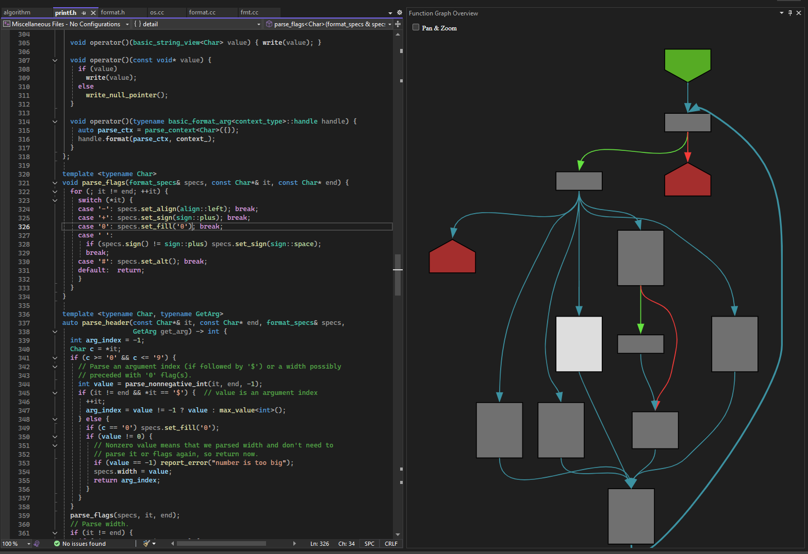
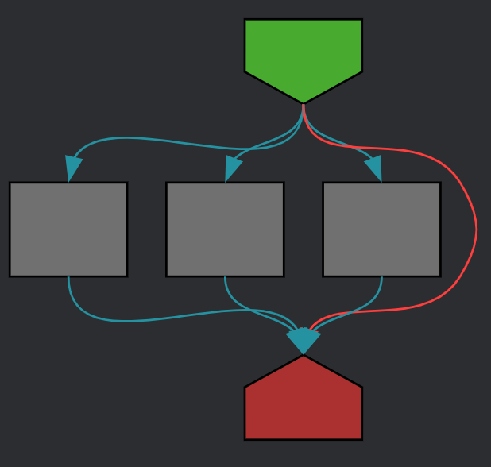
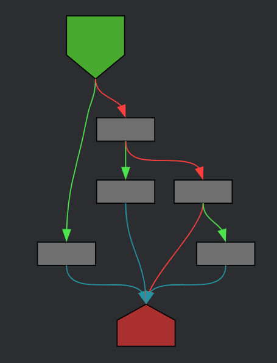

# Function Graph Overview (for Visual Studio)

See live control-flow-graphs of your code!

This extension adds a CFG ([Control-Flow-Graph](https://en.wikipedia.org/wiki/Control-flow_graph))
view for the current function in Visual Studio 2022.

Before installing, you can also try an [interactive demo](https://tmr232.github.io/function-graph-overview/).

The extension currently supports C, C++, Go, Java, Python, and TypeScript & TSX.

This is a port of the [Function-Graph-Overview](https://github.com/tmr232/function-graph-overview/) to Visual Studio.

## Installation

- Using the IDE built-in extension manager:

  <kbd>Extensions</kbd> > <kbd>Manage Extensions</kbd> > <kbd>Search for "Function Graph
  Overview"</kbd> >
  <kbd>Install</kbd>

- You can also download the `.vsix` from the
  [latest release](https://github.com/tmr232/vs-function-graph-overview/releases)
  and install it manually by double-clicking the file.

## Getting Started

1. Open the tool window via <kbd>View</kbd> > <kbd>Other Windows</kbd> > <kbd>Function Graph Overview</kbd>.
2. Open a supported source file and place your cursor inside a function.
3. The graph updates automatically as you move between functions or edit code.

## Features

- **Live CFG rendering** — automatically generates and displays a control flow
  graph for the function under the cursor as you navigate your code.
- **Click-to-navigate** — click a node in the graph to jump to the
  corresponding source location.
- **Color scheme** — choose between Dark, Light, System (follows IDE theme), or
  Custom (paste your own color scheme JSON).
- **Configurable** — toggle simplification, flat switch rendering, and current
  node highlighting.

All settings are available under <kbd>Tools</kbd> > <kbd>Options</kbd> > <kbd>Function Graph Overview</kbd>.

## Settings

### Color Scheme

To change the color scheme of the CFG, open the settings and go to
<kbd>Tools</kbd> > <kbd>Options</kbd> > <kbd>Function Graph Overview</kbd>.

In the `Color scheme` field, you can choose between built-in color schemes
(`Dark`, `Light`, `System`), or create your own:

1. Open the [interactive demo](https://tmr232.github.io/function-graph-overview/)
2. Enable the `Color Picker` above the graph
3. Select the colors you want for your color scheme
4. Press the Copy button to copy the color scheme into the clipboard
5. In Visual Studio, go to <kbd>Tools</kbd> > <kbd>Options</kbd> > <kbd>Function Graph Overview</kbd>
6. Select `Custom` in the `Color scheme` dropdown and paste the JSON into the
   `Custom color scheme` text field

### Flat Switch

Use the `Flat switch` setting to change between two rendering modes for
switch-like statements:

| Flat Switch Enabled                                | Flat Switch Disabled                                 |
|----------------------------------------------------|------------------------------------------------------|
|         |          |

## Contributing

See [CONTRIBUTING.md](CONTRIBUTING.md) for build instructions, architecture
overview, and development workflow.
